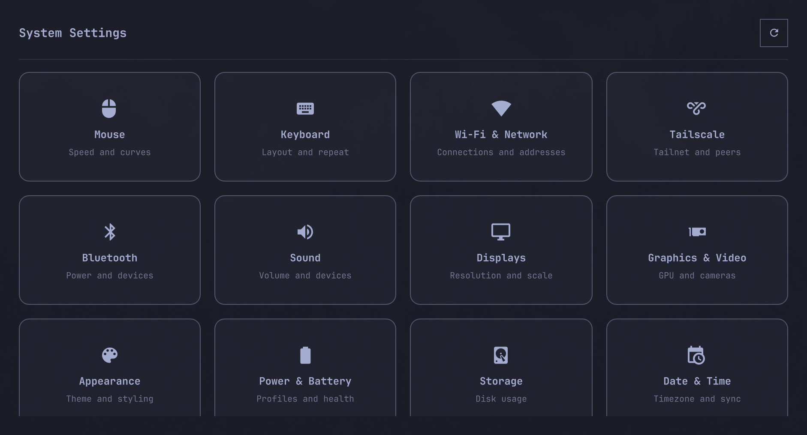

# Omarchy System Settings

A standalone, Omarchy-themed Quickshell control center.



## Current features

- Classic System Preferences-style icon grid
- Embedded copies of Omarchy's first-party Network, Bluetooth, Audio, Display, and Tailscale panels
- Mouse visualization and draggable acceleration-curve editor
- Per-device adaptive, flat, Windows-style, macOS-style, and custom pointer profiles
- Searchable keyboard layout and variant pickers, repeat controls, XKB options, and Num Lock
- Network interfaces, Wi-Fi power, Tailscale status/peers, Bluetooth power and paired devices
- Sound volume, mute, inputs, outputs, and default-device selection
- Display information and persistent scaling
- Graphics adapters and camera inventory
- Omarchy appearance/theme selection and visual desktop-background control
- Game-controller discovery with a shortcut to Steam controller settings
- Printer and scanner discovery with native management-app shortcuts
- Selectable terminal screensaver effects with live preview
- Login startup-command management with Hyprland validation and rollback
- Searchable system locale selection through PolicyKit
- Power profiles plus conditional battery status, health, and cycle count
- Night-light toggle and shared Hyprsunset/Stream Deck Kelvin setting
- Storage, date/time, security/idle, updates, and system information
- Writes native Omarchy Lua configuration
- Reloads and validates Hyprland after every change
- Rolls back automatically if Hyprland rejects generated settings

## Install

```bash
./install.sh
```

Launch **System Settings** from the application launcher or run:

```bash
hypr-control
```

Settings are stored in:

- `~/.config/hypr-control/settings.json`
- `~/.config/hypr/hypr_control.lua`

The generated Lua module is loaded from `~/.config/hypr/input.lua`.

## Development

```bash
python tools/sync_omarchy_panels.py
PYTHONPATH=. python -m unittest discover -s tests -v
PYTHONPATH=. python -m hyprcontrol snapshot
```

Run the panel sync after an Omarchy update to refresh the embedded first-party
panel implementations from `/usr/share/omarchy/shell/plugins/panels`.

## License

MIT
